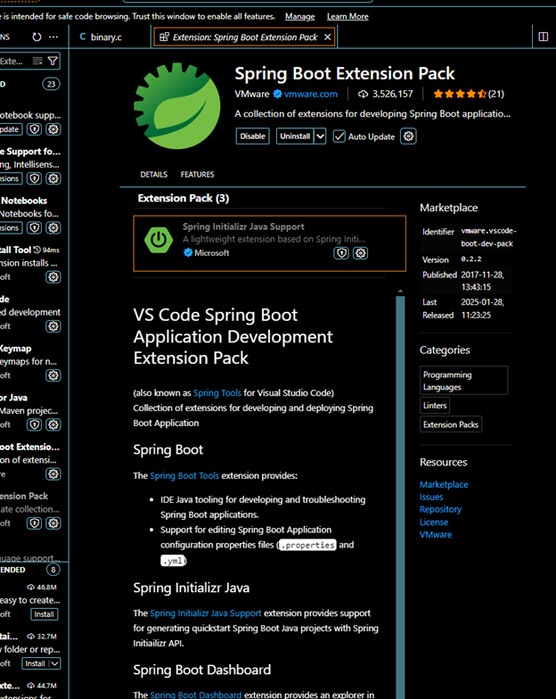
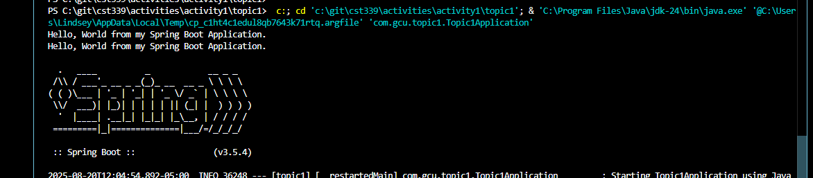
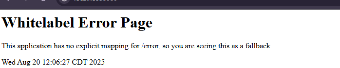
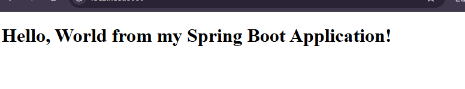
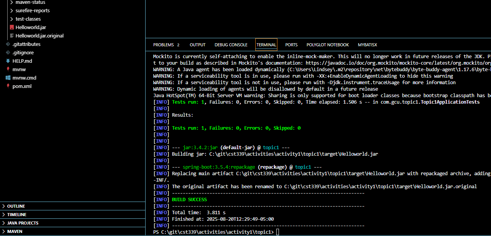
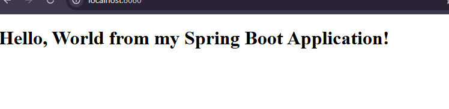
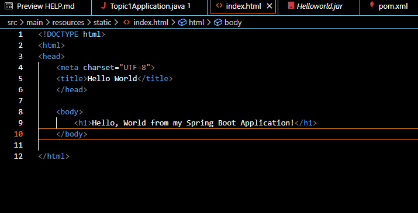

# CST339 - Activity 1 - Introduction to Spring Boot
# Lindsey DeDecker
### August 20th, 2025

## Screenshots
## Part 1

- This is a screenshot of the Spring Tool Suite About Box

- This is a screenshot of the Console Output

- This is a screenshot of the Whitelabel Error Page

- This is a screenshot of the Hello World **index.html** page

## Part 2

- This is a screenshot of the Maven Build configurations as well as showing the hellowrold.jar file

- This is a screenshot of the Java ARchive (JAR) file Execution at local host8080

- This is a screenshot of the Hello World  index.html page

### All research questions have been answered within Halo

## Conclusion

This assignment was helpful in many ways and I learned the following skills:

- How to work on my own markdown file
- How to set up a dev enviornment within visual studio code using Spring Boot
- How Spring Boot will help set up the program with me just needing to make small adjustments
- How to use localhost:8080 to see the program execution

Thank you

