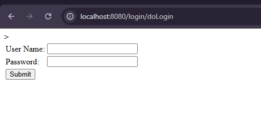
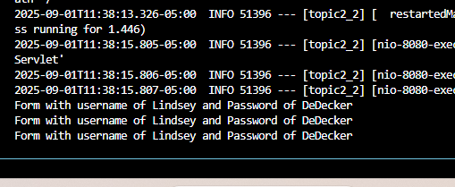
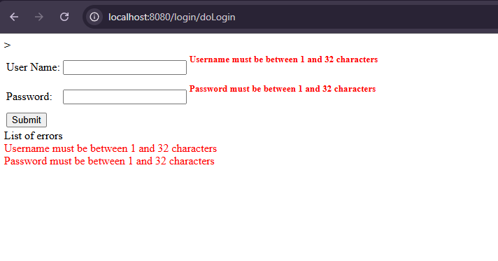
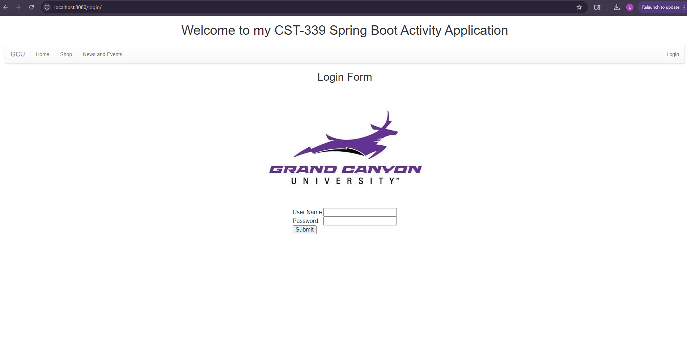
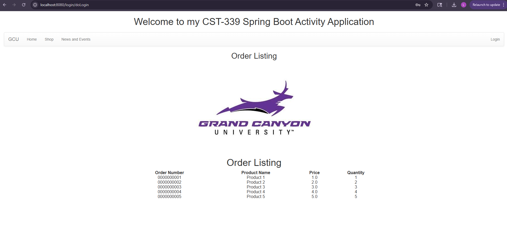

# CST339 - Activity 2 - Spring MVC
# Lindsey DeDecker
### September 1, 2025

## Part 1  Screenshots

- Test 1
#### Using Java, Spring Boot and Thyme, I created a test page that would display Hello World.  To navigate here, I used @Controller and @RequestMapping to ensure that as I continued to create new pages, I am able to navigate to each one appropriately.

- Test 2
#### This is my second test page utilize Java, Spring Boot and Thyme as well.  Here we are navigating to a second test page and have put out text into a heading 2. 

- Test 3
#### The third test page utilizes all the same tools as above. Here I added in a secong message with a different header. 

- Test 4 
#### Test 4 has added a link within the test 2 page to bring the user to the test 4 page. This is a hyper link that was added within the html page. 

#### Here we see the outcome when the 'go to /test4' link is selected

- Controller Routes

#### The controller routes is out welcome page that allows us to navigate to test2 page which then allows us to navigate furthur. 

## Part 2 ScreenShots

- Login Form With no data validation
#### Here we are working on makeing a login page for users.  The Users are able to put in tedxt into both boxes.  To do this and everything following, I utilized Spring Boot and Thyme. I also continued to use @Controller and @GetMapping. 

-Login information displayed in terminal
#### When a user puts their login credentials into the localhost page, it is then displayed back in the terminal.  This shows a test of the login page that then displays the username of "Lindsey" and password of "DeDecker"

- Form naviagates to orders correctly
#### Next, I created a fake order list to be displayed in a table format within html.  This table shows the 4 attributes of the orders.  

- This is a screenshot of the errors that are displayed when the login information is missing or incorrect
#### Here I set error catchers on the username and password for if there is not one present or if the username and password do not meet the require character limit set.

## Part 3  Screenshots

- Screenshot of Login Page using layout
#### Using all the knowledge gained on Spring Boot and Thyme, I created a general login main page that uses GCU information  It includes a welcome, logo, sign in and navigation bar.  

- Screenshot of Orders page with layout
#### Finally you are able to see the orders displayed once a user logs into the generic site created.  There is still the logo, welcome and navigation bar included. 

### All research questions have been answered within Halo

## Conclusion

This assignment was helpful in many ways and I learned the following skills:

- How to use html to create the login, errors and page layout for the web pages
- linking another page within the local host
- Using Spring Boot 
- Using Thyme
- making a functional and designed welcome page and order loading page

Thank you

