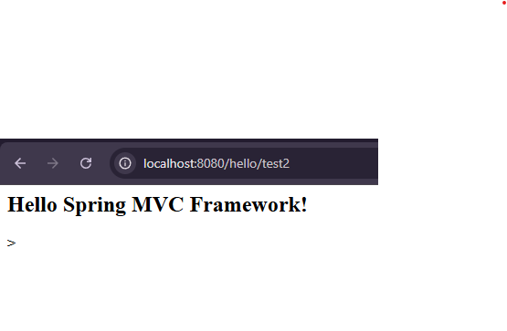

# CST339 - Activity 2 - Spring MVC
# Lindsey DeDecker
### September 1, 2025

## Part 1  Screenshots

- Test 1

- Test 2

- Test 3

- Test 4 

- Controller Routes

## Part 2 ScreenShots

- This is a screenshot of the Maven Build configurations as well as showing the hellowrold.jar file

- This is a screenshot of the Java ARchive (JAR) file Execution at local host8080

- This is a screenshot of the Hello World  index.html page

### All research questions have been answered within Halo

## Conclusion

This assignment was helpful in many ways and I learned the following skills:

- How to work on my own markdown file
- How to set up a dev enviornment within visual studio code using Spring Boot
- How Spring Boot will help set up the program with me just needing to make small adjustments
- How to use localhost:8080 to see the program execution

Thank you

