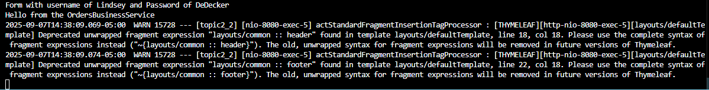
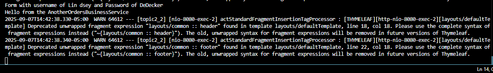
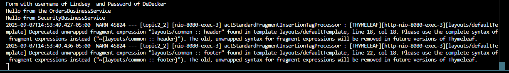
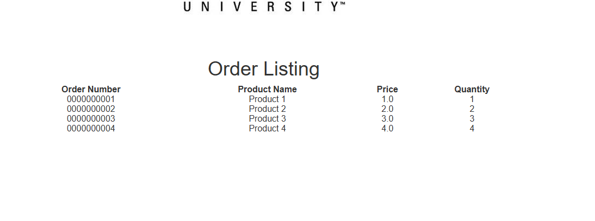
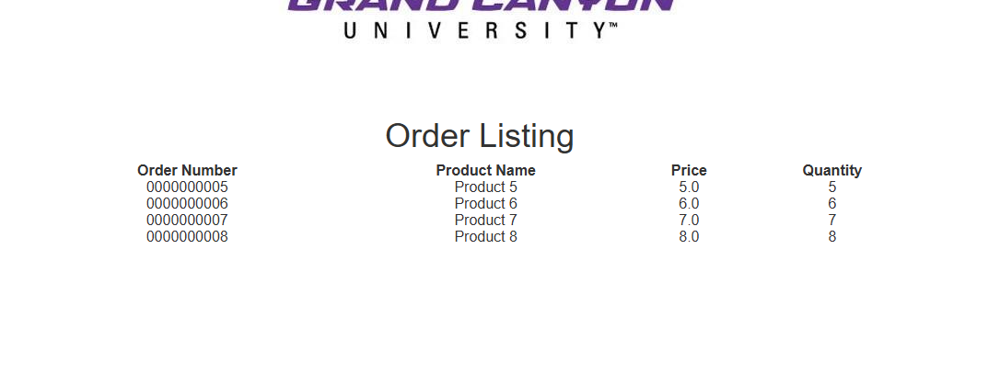

# CST339 - Activity 3 - Spring Bean Service using Spring Core
# Lindsey DeDecker
### September 7, 2025

## Part 1  Screenshots

- Console - After Bean Implimentation
#### Console output is successful.  The application started without errors and displays "Hello from OrdersBusinessService" when login form is successful.  This confirms that the SpringCongif class created the ordersBusinessService bean and @Autowired properly injected the interface into the logincontroller. 

- Console after 2nd bean test
####  This test is the same as above, except there is a new instance of AnotherOrdersBusinessService class.  We expect the console to show "Hello from AnotherOrdersBusinessService" to prove that it is working correctly and it does.

- Console after service security test
####  I have now added a new class and implemented an authenticate method that prints hellp and returns true with the @Service annotation.  When logging in, the console prints that we have made it into this class along with printing the username and password. 

- Local Host Displaying Orders using Bean
####  I have updated the OrdersBusinessService to have a list of orders within it and the SpringConfig class ready to return it.  Upon loggin in, I see that the orders are successfully displaying.  

- Local host displaying orders after bean test 2
####  The same thing as above except I adjusted the SpringConfig to display from 'Another' this time.  The outcome is successfully displaying the second set of orders.

## Part 2 Screenshots

### All research questions have been answered within Halo

## Conclusion

This assignment was helpful in many ways and I learned the following skills:

- How to use html to create the login, errors and page layout for the web pages
- linking another page within the local host
- Using Spring Boot 
- Using Thyme
- making a functional and designed welcome page and order loading page

Thank you