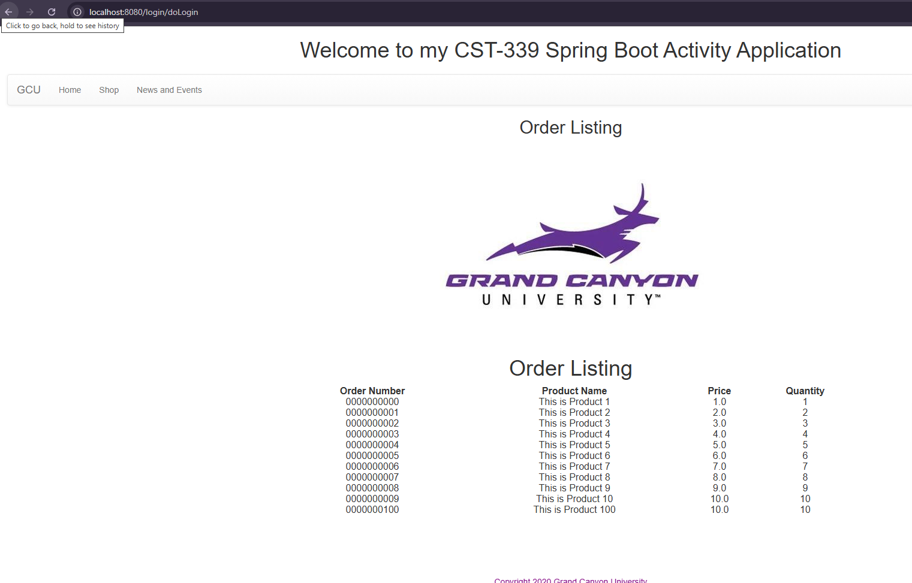
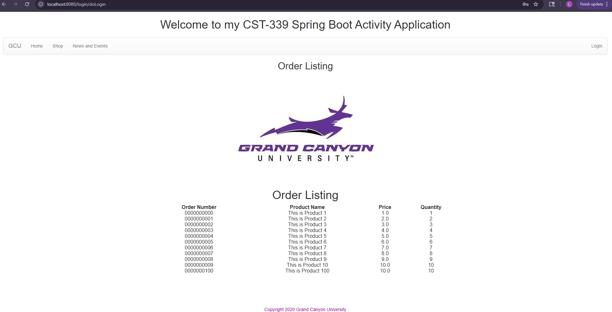
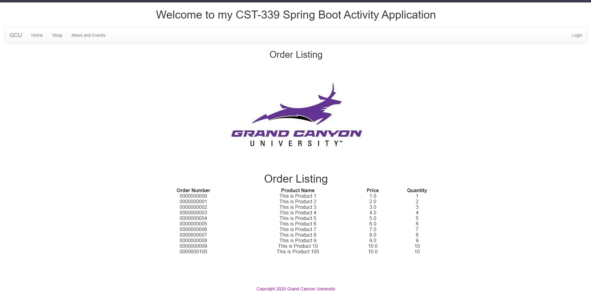

# CST339 - Activity 4 - Spring JDBC
# Lindsey DeDecker
### September 17, 2025

## Part 1  Screenshot

- Database Orders output in Local Host using Spring JDBC
#### Below is a successful output of the orderst hat are in mySQL.  I have successfully connect the two using MAMP and Spring.  The orders are showing as they are expected to.  

## Part 2 Screenshot

- Database Orders output in Local Host using Spring data JDBC
#### I used Spring Data JDBC to get the data from MySQL to show in my table.  I used standard CRUD Repository that is built into Spring Data JDBC.   

## Part  Screenshot

- Creating data services using Spring Data JDBC Native Queries
#### Below is a successful output of the orders that are in mySQL.  I used Repository design patterns to get the data to a relational MySQ@L using Spring Data JDBC.  I used CRUD and override.  

### All research questions have been answered within Halo

## Conclusion

This assignment was helpful in many ways and I learned the following skills:

- MAMP and MySQL Workbench use 
- Connecting MySQL database with the application using Spring JDBC
- Connecting MySQL database with my applicaiton using Spring Data JDBC
- Using CRUD Repositories
- Using custom native SQL queries.

Thank you