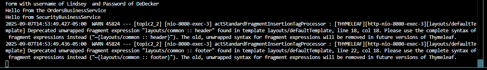

# CST339 - Activity 3 - Spring Bean Service using Spring Core
# Lindsey DeDecker
### September 7, 2025

## Part 1  Screenshots

- Console - After Bean Implimentation
#### Console output is successful.  The application started without errors and displays "Hello from OrdersBusinessService" when login form is successful.  This confirms that the SpringCongif class created the ordersBusinessService bean and @Autowired properly injected the interface into the logincontroller. 

- Console after 2nd bean test
####  This test is the same as above, except there is a new instance of AnotherOrdersBusinessService class.  We expect the console to show "Hello from AnotherOrdersBusinessService" to prove that it is working correctly and it does.

- Console after service security test
####  I have now added a new class and implemented an authenticate method that prints hellp and returns true with the @Service annotation.  When logging in, the console prints that we have made it into this class along with printing the username and password. 

- Local Host Displaying Orders using Bean
####  I have updated the OrdersBusinessService to have a list of orders within it and the SpringConfig class ready to return it.  Upon loggin in, I see that the orders are successfully displaying.  

- Local host displaying orders after bean test 2
####  The same thing as above except I adjusted the SpringConfig to display from 'Another' this time.  The outcome is successfully displaying the second set of orders.

## Part 2 Screenshots

- InIt() method being called
####  The init() method was called once the application had started up.  At this time, Spring created a singleton bean and then would reuse the instance as the application ran if needed.  The destory() method should be called during shut down. I did not see this displayed in the console output.  This is expected because the applicaiton is shutting down at this time. 

- InIt() method being called with the addition of @Scope 
####  The init() method was called multiple time.  The @Scope annotation creates a new instance of OrdersBusinessSErvice each time it is requested. Singleton scope is reused and prototype beans are not reused.  I refreshed my page after load as well and this created another instance of init() beign called. 

- InIt() method being called with the addition of @RequestScope
####  The init() method was called for each HTTP request.  Spring created a new bean instance and calls init() pnce per request.  The same instance can be resued within a single request. The bean is dedstoyed as soon as the request is complete. 

- InIt() method being called with the addition of @SessionScope
####  The init() method was called only once per each broswer having their initial login. Anytime there was a refresh, init() was not called again.  This is expected behavior because SessionScope is going to reuse the same bean for the session it is in and then only call another unique one when there is a different session started

- InIt() method being called without scope
####  The init() method was only called once upon the initial login because it is a singleton bean that was created.  Multiple form submissions and broswer loads will all reuse the same bean instance.  This is why we only see init() called the first time and not again regardless of all the additional loads.

## Part 3: Creating REST Services Using Spring REST Controllers

- JSON output of orders
####  OrdersRestService was successful in returning a JSON array containing the ordermodel objects.  They are displayed with each attribute and int he correct format as we would expect.  @GetMapping was able to be used to get me the correct display type.

- XML output of orders
####  OrdersRestService was successful in returning a XML list of the orders in the correct format. I can see that Spring Boot was able to quickly display the java   objects in XML format. 

- PostMan JSON Testing
####  Using REST API enpoints of both JSON and XML, I was able to get Postman to test the endpoints and receive the correct information about the objects.  REST APIs are helpful for communication, seperation of concerns and professional documentation.  It is also very helpful to be able to test the endpoihnts with postman to verify that they work correctly.   

- Postman XML Testing
 

### All research questions have been answered within Halo

## Conclusion

This assignment was helpful in many ways and I learned the following skills:

- @Autowire to injecty service into controllers
- @Service and @Bean annotations and methods in configuration classes
- Understanding lifecycle methods - init() and destory()
- Project Setup and package organization
- Testing and debugging skills when things did not work on the first try. 
-  REST APIs
- Using JSON and XML printing of orders with GetMapping
- Using Postman to get order information

Thank you