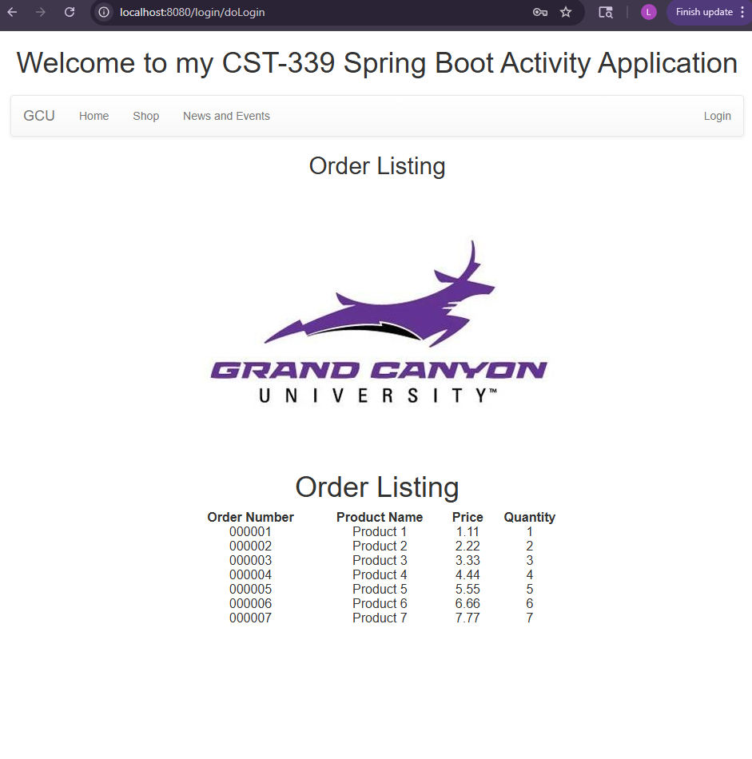
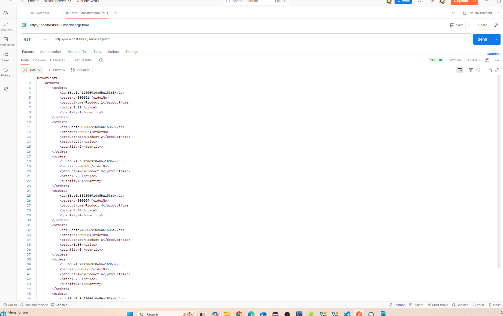
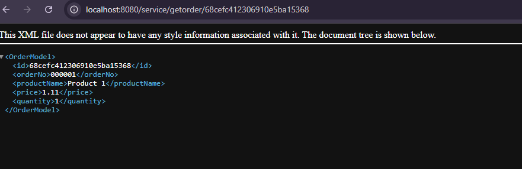
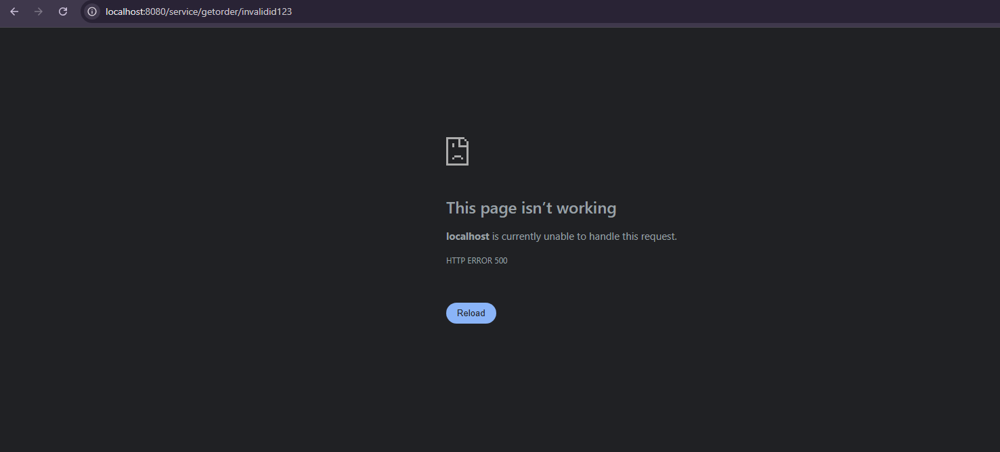

# CST339 - Activity 5 - MongoDB
# Lindsey DeDecker
### September 20, 2025

## Part 1  Screenshots

- MongoDB data connection test
#### Using MongoDB, I have created an orders database, put in sample data and connected it to my application.  Below we can see the screenshot of the successful test run of the connection. The MongoDB data is diaplyaing within the applicaiton correctlya nd as I would expect. 

- JSON REST API
#### To test the JSON REST API, I used Postman.  The application succesffully pulled all orders from the MondoDB database and returned them in JSON format, displaying the order data including id, orderNo, productName, price and quantity.

- XML REST API
#### I also used Postman to test for the XML file.  The application successfully grabbed the same order data from MongoDB and returned it in XML format.  This shows that both REST endpoints are wokring corretly and can serialize the data into the different formats. 

## Part 2 Screenshots

-  Test for Valid ID number search 
####  The application successfully grabbed the order from the MongoDB database and rteturned it as XML with displaying all fo the corret details for the correct order. 

- Test for invalid id number
####  There is an error and nothing is diplayed when Mongo is set to hanbdle not having that ID number within it's data set.   

### Research Questions
### Question: 
Compare and contrast the design of schema in a relational database and a non-relational database. How do they differ, and what impacts does migrating from a relational database to a non-relational database have on your application design?

### Answer:
There are quite a few differences between a relational and non-relational database.  A relational database is going to use structured query language, have a fixed schema making changes more complex, store data in structured tables with fixed schema, and allow multi-user access with concurrency control.  Relational databases are great options for banking/finance, CRM's and ERP's.  A non-relational database is less structured, stores data that is flexible, has a dynamic schema, is easier to modify and has high performance with large-scale data.  It is a great option for real-time analytics, content management systems and social apps that will require rapid scaling.  

 

Migrating from a relational to a non-relational database will require a renovation of the entire data foundation.  The strict, organized tables will change into flexible documents that can contain whatever structure you need at that time.  The application is also now unable to rely on the database and instead has to be able to handle the data rules and relationships.  This will require you to make a lot of changes to your code and really tighten things up.  This would allow you to gain scalability and speed, but also create more complex code and data management. 

### Question:
How does Spring Data support transaction management and the ACID principle?

### Answer:
Spring data handles transaction management through the @Transactional annotatio.  This automatically wraps your methods in database transactions that follow ACID.  Using this annotation has spring creating a boundary that makes it where all database operations either succeed together or fail together.  This is the Atomicity aspect of ACID.  There is also the ability with Spring for isolation.  Using READ_COMITTED or SERIALIZABLE a re two options.  These help prevent bad reads such as uncommitted data or repeat reads.  Isolation is nice for reading the data, but can slow things down.  There are also really helpful ways to control when transactional methods call another transactional method.  Spring and hibernate will work to lock the data so that only one transaction can access the data at a time allowing for more security and better control.

## Conclusion

This assignment was helpful in many ways and I learned the following skills:

- Setting up a MongoDB database
- Connecting my Database with my application
- MongoDB dta modeling
- Repository pattern with MongoDB
- REST API development and testing
- Error handling
- Data Type Conversion
- API Testing

Thank you