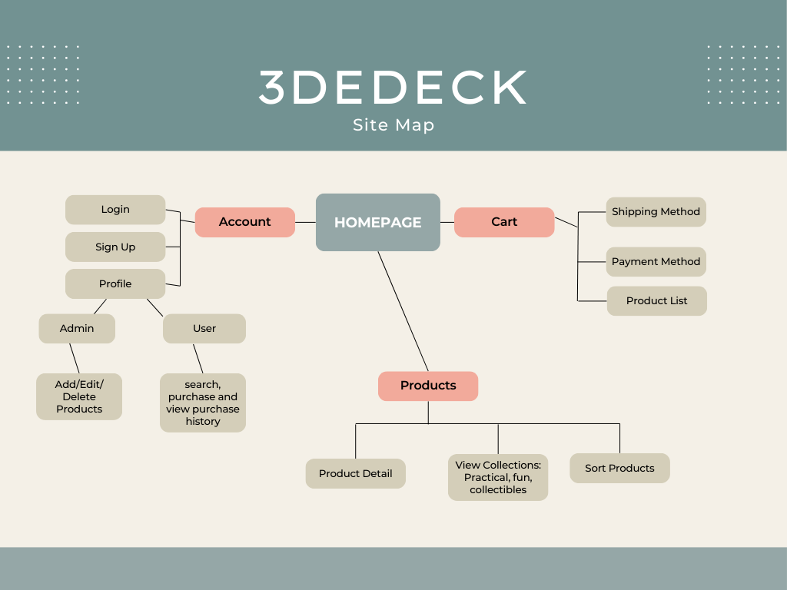

# CST339 - Milestone 3 - 
# Lindsey DeDecker
### September 14, 2025

## 3DeDeck
An asthetically pleasing online storefront for 3D printed items within 3 categories - Fun, Practical and collectibles.  3DeDeck's website will be full functional with login capabilities, inventory changing capabilities, a chopping cart and order history. 

## Video Cast Link
https://youtu.be/CqOq_ZXudvw    

## Tasks Completed
- Main Appplication
    - Home page is operation and has a look that fits the store.
    - There is a menu bar that becomes more expansive when a user logs in. 
    - Style is well developed and fits the theme and vision for the storefront.
    - Login and register features are present on home page of the storefront. 
    - Spring MVC waws used for development.
    - Title '3DeDeck' is in for store.  Logo is in the works and for now is the name of the store

- Registration Mode
    - A user can register on the loaded home page.
    - users are required to provide faist and last name, password, username, email and phone number. 
    - Spring MVC is used.
    - All data entered must be valid before registering.
    - Upon registering, the user is prompted to login.

- Login Mode
    - user must login with valid username and password.
    - Spring MVC is used.
    - Upon logging in, the user is brought to the main product page of the store front. 

- Manage Product Page
    - Admin users can manage products by:
        - adding a new product
        - deleteing products
        - adjusting aspects of the product - price, quanitty, description.

## Technical Approach
- Spring security for login authorization.
- Thyme and html to create a sharp and distinct design that will attract customers to the webpage.
- Custom login/registration forms  and the  ability to toggle between the two.
- Dynamic form generation with JavaScript
- Spring Bean framework for form vbalidation Structure

## Arcitecture Overview
3DeDeck's application follows MVC architecture pattern using the Spring Boot framework along with Thymeleaf.  

## Technology Stack
- Spring Boot for backend framework
- Thymeleaf for template design
- HTML, CSS and JavaScript
- Maven
- Java

## Known Issues
- Getting the design and implementation fo the products up and running.
- Getting product management up and runnign with the site so that users can search for products
- Maybe verifying when a user logs in if they are a user or admin to only display the manage products to admin

## Risk 
- Security 
    - I need to work next week to really get the security for logging in and registering working correctly. 
    - There is no authentication for users when they log in.
- Database
    - There is no hook up or set up ready for a database.  This will all have to be added in independently. 
- Application Completion
    - There are a lot of missing items or classes that are started without being completed.  
        - Only 4 weeks left to complete the project with all classes working and user and admin profiles.

## Installation and Configuration
- Using the latest version of Java
- Runnign the main applicaiton within local host

## High-Level Features and Functionality
- User Registration and Login
- Prodcut Browsing
    - Sort (price, alphabetical)
    - By Category
    - Search
- Product Detail Page
- Admin-only product management
- Product Management
    - adding new items
    - Editing current inventory
    - Delete inventory

## User Interface Flow Diagram
User will first see the home page with a toggle between login and registration.  If the user successfully logs in, they will see the product page.  If the login is unsuccessful, they will  be prompted to tyr again.  If the users attempts to register unsuccessfully, they will be prompted to try agian.  If they are successful, they will be prompted to login. 

Within the product page, the user will be able to choose managege products. If they click on this, it will take them to the product management page. Here they can choose add, edit or delete inventory.  Upon selecting add inventory, the user will be able to put in the credentials to add new items to the inventory. 

## Sitemap

## Planning 

This project is solo.  Below is my plan for each week as it works with my schedule.  Wednesday I do not work and the weekend will be the most time I am able to commit to the projects.
|Day|Plan|
|--|--|
|Mondays|Answer DQ question|
|Tuesday|**|
|Wednesday|Finish Activity & Start Milestone|
|Thursday|Discussion, Look at Milestone|
|Friday|**|
|Saturday|Work on Milestone, Discussion|
|Sunday|Finish up Milestone, Discussion|

## Resources

- https://docs.mermaidchart.com/blog/posts/easier-diagram-editing-with-code-snippets

- https://www.w3schools.com/howto/howto_css_login_form.asp

- https://www.youtube.com/watch?v=Jh40uRabHcI   

- https://docs.mermaidchart.com/mermaid-oss/syntax/flowchart.html#document
