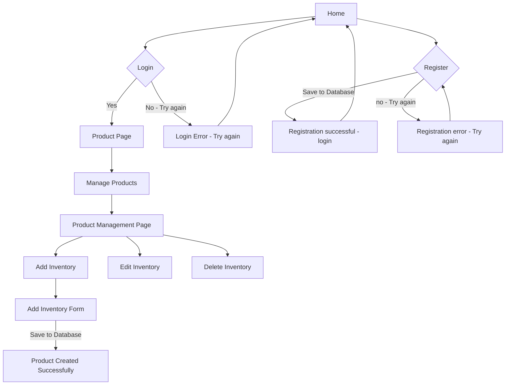

# CST339 - Milestone 4 - 
# Lindsey DeDecker
### September 20, 2025

## 3DeDeck
An asthetically pleasing online storefront for 3D printed items within 3 categories - Fun, Practical and collectibles.  3DeDeck's website will be full functional with login capabilities, inventory changing capabilities, a chopping cart and order history. 

## Video Cast Link

## Milestone Code Link
https://github.com/lindsdeck/cst339/tree/main/milestones/milestone2/dedeck

## Tasks Completed
- Main Appplication
    - Home page is operation and has a look that fits the store.
    - There is a menu bar that becomes more expansive when a user logs in. 
    - Style is well developed and fits the theme and vision for the storefront.
    - Login and register features are present on home page of the storefront. 
    - Spring MVC waws used for development.
    - Title '3DeDeck' is in for store.  Logo is in the works and for now is the name of the store
    - Refactored to use consistent styling and themes across all pages for final presentation

- Registration Mode
    - A user can register on the loaded home page.
    - users are required to provide faist and last name, password, username, email and phone number. 
    - Completely refactored to user Spring Data JPA with MySQL database integration
    - Uses UserEntity, UserRepository, and UserDataService following DAO/repository design patterns
    - All data entered must be valid before registering.
    - Upon registering, the user is prompted to login.
    - Registration now successfully saves users to MySQL database.

- Login Mode
    - user must login with valid username and password.
    - Refactored to sue Spring Data JPA with database authentication.
    - Uses same repository and DAO patterns as registration module
    - Upon logging in, the user is brought to the main product page of the store front. 

- Manage Product Page
    - Admin users can manage products by:
        - adding a new product that is saved in MySQL
        - deleteing products
        - adjusting aspects of the product - price, quanitty, description.

## Technical Approach
- Spring security for login authorization.
- Thyme and html to create a sharp and distinct design that will attract customers to the webpage.
- Custom login/registration forms  and the  ability to toggle between the two.
- Dynamic form generation with JavaScript
- Spring Bean framework for form vbalidation Structure
- Spring Data JPA for database persistence and ORM mapping
- MySQL database with MAMP for local development
- Repository design pattern for data access abstraction
- DAO pattern through data service class
- JPA entity annotations for database table mapping

## Arcitecture Overview
3DeDeck's application follows MVC architecture pattern using the Spring Boot framework along with Thymeleaf.  

## Technology Stack
- Spring Boot for backend framework
- Spring Data JPA for Database operations
- MySQL with MAMP for database management
- JPA/Hibernate for ORM
- Thymeleaf for template design
- HTML, CSS and JavaScript
- Maven
- Java

## Known Issues
- Product searching and filtering functionality needs implemented
- Admin vs User role distinction needs security implementation
- Shopping cart and order history features pending

## Risk 
- Security 
    - Basic authentication is wokring with database validation,. but needs enhancement for production
- Database
    - Previous risk has been resolved 
- Application Completion
    - Signficat progress has been made
        - Core data persistence and user management fully funtional 

## Installation and Configuration
- Using the latest version of Java
- MySQL database setup with MAMP on port 3306
- Database name: cst339 with users and product tables
- Spring Boot application runs on localhost:8080
- Maven dependencies managed for Spring Data JPA and MySQL connector

## High-Level Features and Functionality
- User Registration and Login with database persistence
- Product creation with database storage
- Prodcut Browsing
    - Sort (price, alphabetical)
    - By Category
    - Search
- Product Detail Page
- Admin-only product management
- Product Management
    - adding new items to database
    - Editing current inventory
    - Delete inventory

## User Interface Flow Diagram
User will first see the home page with a toggle between login and registration.  If the user successfully logs in, they will see the product page.  If the login is unsuccessful, they will  be prompted to tr yagain.  If the users attempts to register unsuccessfully, they will be prompted to try agian.  If they are successful, they will be prompted to login. The user registration information will also be saved within the database. 

Within the product page, the user will be able to choose managege products. If they click on this, it will take them to the product management page. Here they can choose add, edit or delete inventory.  Upon selecting add inventory, the user will be able to put in the credentials to add new items to the inventory.  This information will also be saved within the database

## Sitemap

## Planning 

This project is solo.  Below is my plan for each week as it works with my schedule.  Wednesday I do not work and the weekend will be the most time I am able to commit to the projects.
|Day|Plan|
|--|--|
|Mondays|Answer DQ question|
|Tuesday|**|
|Wednesday|Finish Activity & Start Milestone|
|Thursday|Discussion, Look at Milestone|
|Friday|**|
|Saturday|Work on Milestone, Discussion|
|Sunday|Finish up Milestone, Discussion|

## Resources

- https://docs.mermaidchart.com/blog/posts/easier-diagram-editing-with-code-snippets

- https://www.w3schools.com/howto/howto_css_login_form.asp

- https://www.youtube.com/watch?v=Jh40uRabHcI   

- https://docs.mermaidchart.com/mermaid-oss/syntax/flowchart.html#document

- https://spring.io/projects/spring-data-jpa

- Information within Activity assignments in CST339
